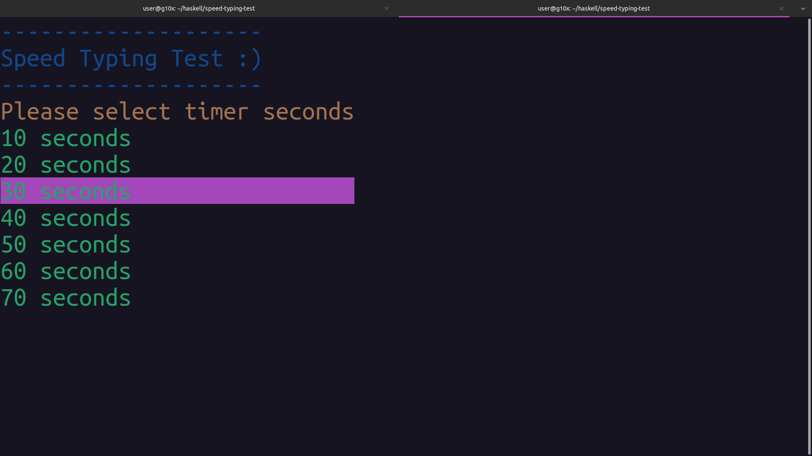
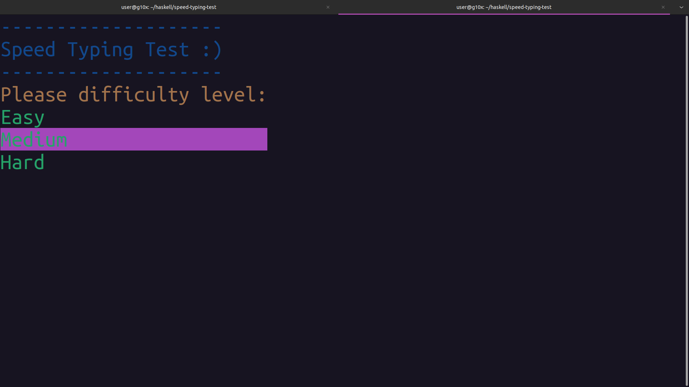
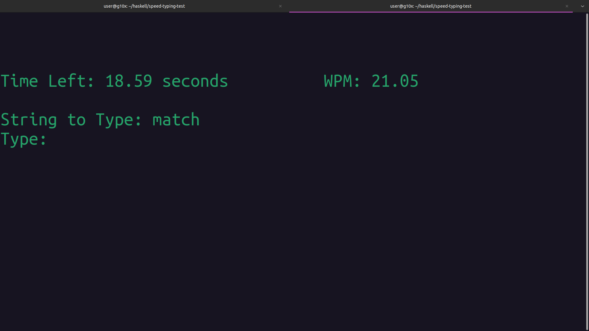
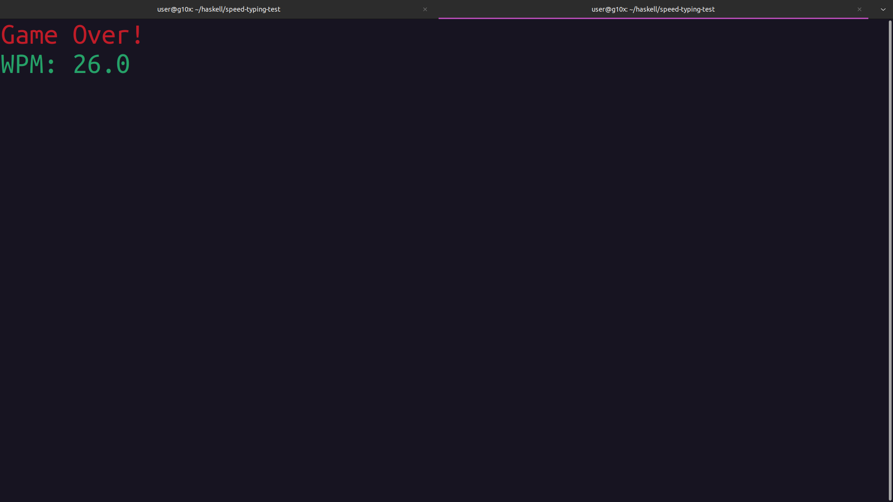

## Speed Typing Test in Haskell

This is a command-line game written in Haskell using the [Vty](https://hackage.haskell.org/package/vty-6.2) library. Users can select the timer duration and difficulty level. Once the game starts, words will appear on the screen for the user to type. The timer will count down, and the current typing speed in words per minute (WPM) will be displayed. The application utilizes concurrency and the State Transformer monad for managing game state.

## How to Run

1. **Ensure you have Cabal and GHC installed**:
   - Install [Cabal](https://www.haskell.org/cabal/download.html)
   - Install [GHC](https://www.haskell.org/ghc/download.html)

2. **Clone the project**:
    ```sh
    git clone https://github.com/tusharad/speed-typing-test-haskell
    ```

3. **Build the project**:
    ```sh
    cd speed-typing-test-haskell
    cabal build
    ```

4. **Run the project**:
    ```sh
    cabal run
    ```

## Screenshots






_Project is still under development!_